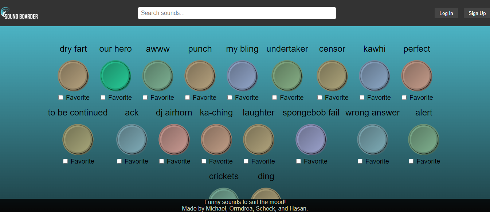

# Sound Border

## Description
 
 Our app's goal is to provide an entertaining experience that users of all ages could have fun with.
 Enjoy a wide range of funny sounds, from goofy noises to playful sound effects and memes, that will keep you entertained. just press the button and play one of the sound guaranted to make you laugh.

## Installation

1. You will need to install node, bcrypt, express, postgres & sequelize.

2. Seed the database with npm run seed

3. Create a personal dotenv file and add it to your repo.

4. Run the application with run npm start or nodemon server and enjoy!

## Usage

Sound Boarder may be used to play pre-loaded sounds with the touch of a button. Click any button to hear its audio or check the box beneath it to favorite it. Creating your own profile will allow you to keep a list of favorited buttons on your profile page. There is also an audio recorder function, which allows users to record their own original sounds. 

## Screenshot

## Links

## Credits
  
   https://github.com/asupt - Hasan Khan
   https://github.com/ScheckJ - Scheck Jah
   https://github.com/Mikeferg2050 - Mike Ferguson
   https://github.com/Orrndrea  -  Orrndrea Jones

## License

N/A